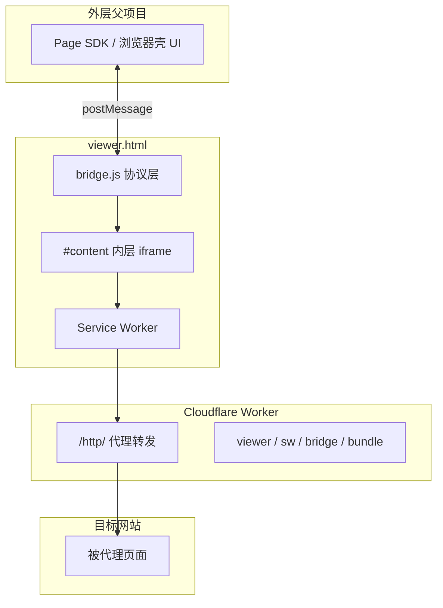

# virtual-chromo 路线图

## 愿景

virtual-chromo 是嵌入外层「浏览器壳」项目的 **iframe WebView**。对外表现类似 **Playwright 控制的浏览器**：

- 父项目**不能直接访问** iframe 内的 DOM（跨源隔离）
- 但通过 postMessage 协议，可以完成导航、执行脚本、操作页面等**几乎所有浏览器自动化能做的事**
- 组件本身**不提供**地址栏、站点列表等独立导航 UI，一切由外层决定

部署形态：单个 **Cloudflare Worker** 同时提供代理 API 与 iframe 前端静态资源。

## 与 jsproxy 的关系

| 维度 | jsproxy 原版 | virtual-chromo |
|------|-------------|----------------|
| 定位 | 独立在线代理网站 | 浏览器壳里的受控 WebView |
| 导航 | 用户自行输入 URL | 父项目 postMessage 下发 |
| 部署 | 前后端可分离 | Worker 自包含 |
| 代码 | 开源但未提供 bundle 源码 | 核心 bundle 暂为复制品，计划逐步替换 |

借鉴 jsproxy 的 **Service Worker 代理 + Worker 纯转发 + API 虚拟化** 思路；产品形态与通信层为自研。

## 架构



**双层 iframe**：外层 `viewer.html` 永不卸载，负责 SW 注册与 postMessage；内层 `#content` 加载 `/-----https://...` 代理页。

## 当前进度

### 已完成

- [x] CF Worker 代理核心（`/http/` 转发，基于 jsproxy cf-worker 改造）
- [x] Worker 自包含静态资源（`public/`）
- [x] `viewer.html` iframe 外壳（无导航 UI）
- [x] Service Worker 安装与 jsproxy bundle 集成
- [x] postMessage 基础协议：导航、历史、加载状态
- [x] `VC_EVAL`：父页面在子页面执行 JS 并获取返回值
- [x] `public/inject.js`：代理 HTML 注入（console hook、dialog noop）
- [x] `VC_LOAD_FAILED`、Console（`VC_CONSOLE_UPDATED` + `VC_CONSOLE_READ`）
- [x] 协议文档（[docs/protocol.md](docs/protocol.md)）与父项目 Demo（[docs/parent-demo.html](docs/parent-demo.html)）
- [x] **被动导航**（build `20260727-v15`+）：子页点击 / 改 location 只上报 `VC_CLICK` / `VC_LOCATION`，不自主换页；唯一换页入口为父级 `VC_NAVIGATE`
- [x] **Session / BrowserContext**（build `20260727-v17`+）：`/s/<sessionId>/` 路由、cookie/storage 分区、多 tab 同步、`VC_SESSION_*` 协议

### 进行中 / 待验证

- [ ] 跨源 iframe 端到端测试（父项目 + Worker 分源部署）
- [ ] Cloudflare Worker 生产部署与 `account_id` 配置

## 阶段规划

### 阶段 1：控制协议（eval 原语 + 可选语义糖）

**核心**：把 `VC_EVAL` 的父项目侧封装（Promise + 超时 + 良好文档）做到位。子页面内读/写/等待均可直接写 JS，**不必**为每种 Playwright 方法单独设计 RPC。

#### 能力清单（全量 #1–#32）

**标注图例**：`必须` · `核心` · `已有` · `建议保留` · `可选` · `可不实现` · `待实现` · `子页面内`（无上级协议）· `随#N`

| # | 能力 | 类型 | Playwright | 状态 | 标注 |
|---|------|------|------------|------|------|
| 1 | `VC_NAVIGATE` | 命令 | `page.goto()` | 已有 | `必须` · `已有` |
| 2 | `VC_BACK` | 命令 | `page.goBack()` | 已有 | `必须` · `已有` |
| 3 | `VC_FORWARD` | 命令 | `page.goForward()` | 已有 | `必须` · `已有` |
| 4 | `VC_RELOAD` | 命令 | `page.reload()` | 已有 | `必须` · `已有` |
| 5 | `VC_PING` | 命令 | — | 已有 | `可选` · `已有` |
| 6 | `VC_EVAL` | 命令 | `page.evaluate()` | 已有 | `核心` · `必须` · `已有` |
| 7 | `VC_CLICK` | 事件 | 子页点击上报 | 已有 | `建议保留` · `已有` |
| 8 | `VC_FILL` | 命令 | `page.fill()` | 计划 | `可不实现` |
| 9 | `VC_QUERY` | 命令 | 读 DOM | 计划 | `可不实现` |
| 10 | `VC_WAIT_FOR` | 命令 | `page.waitForSelector()` | 计划 | `可不实现` |
| 11 | `VC_GET_STATE` | 命令 | `page.url()` / `page.title()` | 计划 | `可不实现` · 事件替代 |
| 12 | `VC_SCREENSHOT` | 命令 | `page.screenshot()` | 已有 | `必须` · `已有` |
| 13 | `VC_SCROLL` | 命令 | 滚动 | 计划 | `可不实现` |
| 14 | `VC_READY` | 事件 | — | 已有 | `必须` · `已有` |
| 15 | `VC_NAVIGATING` | 事件 | 即将导航 | 已有 | `必须` · `已有` |
| 16 | `VC_NAVIGATED` | 事件 | 加载完成 | 已有 | `必须` · `已有` |
| 17 | `VC_LOADING` | 事件 | 加载中 | 已有 | `必须` · `已有` |
| 18 | `VC_ERROR` | 事件 | — | 已有 | `必须` · `已有` |
| 19 | `VC_PONG` | 事件 | — | 已有 | `可选` · `随#5` · `已有` |
| 20 | `VC_CONSOLE_UPDATED` | 事件 | console 有新条目 | 已有 | `建议保留` · `已有` |
| 21 | `VC_CONSOLE_READ` | 命令 | 拉取 console 历史 | 已有 | `建议保留` · `已有` |
| 22 | `VC_DOWNLOAD` | 事件 | `page.on('download')` | 计划 | `可选` |
| 23 | `VC_EVAL_RESULT` | RPC 响应 | — | 已有 | `必须` · `随#6` · `已有` |
| 24 | `VC_CLICK_RESULT` | RPC 响应 | — | 计划 | `可不实现` · `随#7` |
| 25 | `VC_FILL_RESULT` | RPC 响应 | — | 计划 | `可不实现` · `随#8` |
| 26 | `VC_QUERY_RESULT` | RPC 响应 | — | 计划 | `可不实现` · `随#9` |
| 27 | `VC_WAIT_FOR_RESULT` | RPC 响应 | — | 计划 | `可不实现` · `随#10` |
| 28 | `VC_GET_STATE_RESULT` | RPC 响应 | — | 计划 | `可不实现` · `随#11` |
| 29 | `VC_SCREENSHOT_RESULT` | RPC 响应 | — | 已有 | `必须` · `随#12` · `已有` |
| 30 | `VC_SCROLL_RESULT` | RPC 响应 | — | 计划 | `可不实现` · `随#13` |
| 31 | `VC_CONSOLE_READ_RESULT` | RPC 响应 | — | 已有 | `建议保留` · `随#21` · `已有` |
| 32 | `VC_LOAD_FAILED` | 事件 | 加载失败 | 已有 | `建议保留` · `已有` |
| 33 | `VC_LOCATION` | 事件 | 子页改 location 上报 | 已有 | `建议保留` · `已有` |
| 34 | `VC_HISTORY` | 事件 | SPA pushState / popstate | 已有 | `建议保留` · `已有` |

**页面生命周期**（#15 / #17 / #16 / #32 分工，避免只靠 boolean）：

| 阶段 | 事件 | 状态 |
|------|------|------|
| 即将开始加载 | #15 `VC_NAVIGATING` `{ url }` | 已有 |
| 正在加载 | #17 `VC_LOADING` `{ loading: true, url? }` | 已有 |
| 加载完成 | #16 `VC_NAVIGATED` `{ url, title, canGoBack, canGoForward }` + #17 `{ loading: false }` | 已有 |
| 加载失败 | #32 `VC_LOAD_FAILED` `{ url, message?, code? }` | 已有 |

典型顺序：`VC_NAVIGATING` → `VC_LOADING(true)` → `VC_NAVIGATED` + `VC_LOADING(false)`；失败时 `VC_LOAD_FAILED`（及可选 `VC_ERROR`）。

#### Console（#20 + #21 + #31）

- 子页面经 [`public/inject.js`](public/inject.js) + `conf.js` `inject_html` 注入，hook `console.*`，写入 bridge 侧 ring buffer；**每条日志独立 UUID**。
- **#21 拉取**：`VC_CONSOLE_READ` 传入 `after`（某条 UUID 之后）与 `limit`，只返回增量；父级 DevTools 可轮询或配合 #20。
- **#20 通知**：`VC_CONSOLE_UPDATED` **不含日志正文**，仅告知「有新条目」；父级收到后再调 #21。可带 `latestId` / `count` 便于 UI。
- 不做 Playwright 式逐条 push 全文。

#### 原生 dialog（无上级协议）

- **不实现 #21 旧方案的 `VC_DIALOG` 事件**（与上级交互成本高）。
- 子页面内拦截 `alert` / `confirm` / `prompt` → **noop**（`confirm` 返回 `false`，`prompt` 返回 `null`），并在 console **`warn` 说明已跳过**。
- **`beforeunload` 不拦截**（保留调试与 SW 刷新行为）。

#### 分析摘要

| 标注 | 项数 | # |
|------|------|---|
| `必须` / `核心`（最低集成集） | 11 | 1–4, 6, 14–18, 23 |
| `已有` | 19 | 1–6, 14–21, 23, 31–32 |
| `可不实现` | 12 | 7–11, 13, 24–28, 30 |
| `建议保留` | 5 | 20, 21, 31, 32（+ 生命周期 #15–17 已有） |
| `待实现` | 2 | 12, 29 |
| `可选` | 3 | 5, 19, 22 |

**AI / Agent 最低实现**：#1–4 + #6 + #23，监听 #14–18；页面状态跟 #15–17；console 用 #20 触发 + #21 拉取。

**阶段 1 实际要做**：#20/#21/#31/#32 已完成；#12 暂缓；#7–11/#13 按需；Page SDK 见阶段 2。

### 阶段 2：父项目 Page SDK

在父项目侧提供统一客户端，隐藏 postMessage 细节。**SDK 应以 `evaluate()` 为一等公民**，语义方法（`click`、`fill`）可以是薄包装：

```javascript
const page = createChromoPage(iframe)

await page.goto('https://example.com')
const links = await page.evaluate(() =>
  [...document.querySelectorAll('a')].map(a => a.href)
)
await page.evaluate(() => document.querySelector('#login')?.click())
```

- 所有 RPC 返回 Promise，支持 timeout
- `page.evaluate(code)` 与协议 `VC_EVAL` 一一对应；其余方法可选

### 阶段 3：替换 jsproxy 压缩 bundle

`public/bundle.js` 为 jsproxy 编译产物，无法维护。分析时可按层次选用：

- [`bundle.formatted.js`](public/bundle.formatted.js) — 压缩 bundle 的 beautify 版（与运行时逻辑 1:1，带行号）
- [`bundle.reconstructed.js`](public/bundle.reconstructed.js) — 从 [jsproxy-browser 源码](https://github.com/EtherDream/jsproxy-browser) 还原的可读版（原始变量名 + 模块注释；含 virtual-chromo 的 `index.vc.js`）
- [`jsproxy-src/`](public/jsproxy-src/) — 分文件源码副本

更新 bundle 后：`npm run format:bundle` / `npm run reconstruct:bundle`。逐步用可读源码替换：

```
public/inject.js         # 已实现：代理 HTML 注入（console、dialog noop）
src/client/
  inject.js              # 阶段 3 迁移目标（自 bundle 剥离后）
  sw.js                # SW 入口
  fetch-proxy.js       # 拦截 /----- 请求 → /http/
  api-hook.js          # document.domain 等 API 重写
  dom-hook.js          # MutationObserver
  location-patch.js    # location → __location
```

**子页面注入**：所有 HTML 均经 Worker / SW 中转，在响应体**最前面**插入 `<script src=".../inject.js">`（或内联），保证早于页面任意脚本。console hook、dialog 替换等都在此完成，**不依赖** `VC_NAVIGATED` 后再 eval 注入。

每完成一块，从 bundle 中剥离对应能力，最终移除黑盒依赖。

### 阶段 4：生产加固

- [ ] postMessage origin 白名单（生产必开）
- [ ] SSRF / 内网访问限制（参考 jsproxy `setup-ipset` 思路）
- [ ] WebSocket 代理（`/ws`，jsproxy CF 版未实现）
- [ ] 外链白名单（`allowed-sites.conf` 逻辑）

## 设计原则

1. **跨源边界**：父项目永远不碰子页面 DOM，只走协议
2. **被动 WebView**：子页面不能自主导航或开真 tab；点击 / location 变更只上报，由父级决定是否 `VC_NAVIGATE`
3. **viewer 外壳不导航**：外层 shell 只负责 SW + bridge，内层 iframe 才加载代理页
4. **父项目不同源**：父页面不得与 Worker 同域，否则 SW 接管整个站点
5. **可维护优先**：新能力写在 `bridge.js`、`inject.js` 与 `jsproxy-src/`，经 webpack 产出 `bundle.built.js`

## 已知限制（继承自 jsproxy）

- 无 WebSocket 代理
- 无外链白名单
- 依赖 Service Worker（不支持 IE）
- `location` 动态访问可能逃逸沙盒
- 部分站点 JS 可能检测 iframe 环境

## 相关文档

- [docs/protocol.md](docs/protocol.md) — postMessage 协议
- [docs/KNOWN-ISSUES.md](docs/KNOWN-ISSUES.md) — 已知问题（被动导航、inject、console 等）
- [docs/jsproxy-legacy-decoupling.md](docs/jsproxy-legacy-decoupling.md) — jsproxy 遗留耦合与斩断清单（外联 CDN、多节点、adjustNav 等）
- [docs/parent-demo.html](docs/parent-demo.html) — 父项目接入示例
- [README.md](README.md) — 开发与部署
