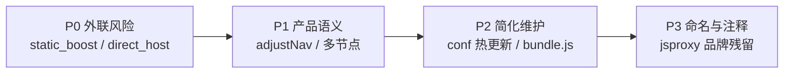

# jsproxy 遗留耦合与斩断清单

记录从上游 [jsproxy / jsproxy-browser](https://github.com/EtherDream/jsproxy) 继承、但与 virtual-chromo「受控 WebView」定位不符的代码与外部联系。**先建档、再分批移除**；改代码前以此为准核对。

版本与构建号见 `public/conf.js`（`VC_VERSION` / `VC_BUILD`）。

---

## 状态说明

| 标记 | 含义 |
|------|------|
| **活跃** | 当前配置下会执行，或可能影响运行时行为 |
| **休眠** | 代码在 bundle 中，但 `conf.js` 未启用相关开关，通常不会触发 |
| **死代码** | 逻辑存在，virtual-chromo 产品路径不会走到 |
| **仅文档/工具** | 不参与 SW 运行时，但体现与上游的耦合 |

---

## 1. static_boost + jsDelivr 预缓存 CDN

| 项 | 内容 |
|----|------|
| **状态** | 休眠 |
| **是什么** | jsproxy 原版的「常用静态资源 CDN 加速」：从 npm 包 `jsproxy-cache-01`（经 jsDelivr）拉取 URL hash → 版本映射表与预存响应体，命中则跳过 Worker 代理。 |
| **硬编码地址** | `https://cdn.jsdelivr.net/npm/jsproxy-cache-01@0.0.` + 版本号 |
| **源码** | [`public/jsproxy-src/cdn.js`](../public/jsproxy-src/cdn.js)（`loadStaticList`、`proxyStatic`）；调用链 [`network.js`](../public/jsproxy-src/network.js) `cdn.getFileVer` / `cdn.proxyStatic` |
| **配置开关** | `conf.static_boost.enable` + `conf.static_boost.ver` — **当前 `conf.js` 未配置** |
| **风险** | 若日后误开 `static_boost`，SW 会向第三方 CDN 发请求，依赖 EtherDream 维护的缓存包，与自托管 Worker 架构冲突。 |
| **建议** | 删除 `cdn.js` 中 static 分支，或改为显式 opt-in 且默认关闭；重建 `bundle.built.js`。 |

---

## 2. direct_host_list（直连主机白名单）

| 项 | 内容 |
|----|------|
| **状态** | 休眠（且存在潜在 bug） |
| **是什么** | 从 `assets_cdn + direct_host_list` 拉取文本列表，对支持 CORS 的 host 尝试浏览器直连，绕过代理。 |
| **源码** | [`cdn.js`](../public/jsproxy-src/cdn.js) `loadDirectList`、`isDirectHost`、`proxyDirect`；[`network.js`](../public/jsproxy-src/network.js) 请求路径中的 `direct hit` 分支 |
| **配置** | `conf.direct_host_list` — **当前 `conf.js` 未配置** |
| **风险** | `setConf` 无条件调用 `loadDirectList`；`direct_host_list` 为 `undefined` 时会 `fetch('/undefined')`（本地无效请求，非外网，但属遗留粗糙逻辑）。启用后可能让部分流量**不经 Worker**，破坏 session / 审计一致性。 |
| **建议** | 与 static_boost 一并移除，或加 `if (!conf.direct_host_list) return` 守卫；virtual-chromo 应统一走 `/http/` 代理。 |

---

## 3. 多节点路由（node_map / node_acc）

| 项 | 内容 |
|----|------|
| **状态** | 活跃（简化为单节点） |
| **是什么** | jsproxy 在线代理的**多 Worker / 多线路负载均衡**：按 URL hash 权重选 `node_map` 中的 host，请求经 `https://{node}/http/...` 转发。 |
| **源码** | [`route.js`](../public/jsproxy-src/route.js) `getHost`、`setConf`；[`network.js`](../public/jsproxy-src/network.js) 选 host 与重试逻辑 |
| **当前配置** | `conf.js` 仅 `node_default: 'local'`，`node_map.local.lines` 为当前 `location.host` |
| **风险** | 保留完整多节点协议（含 `node_acc` 实验分支），增加复杂度；若误配外部 node host，流量会打到第三方 jsproxy 部署。 |
| **建议** | 收敛为「仅当前 Worker origin」；删除 `node_acc`、权重表与远程 node 切换；Worker 侧已自包含转发，不需要浏览器端选路。 |

---

## 4. 地址栏式导航与 Google 默认搜索（adjustNav）

| 项 | 内容 |
|----|------|
| **状态** | 活跃（navigate 模式） |
| **是什么** | 上游「独立代理站」行为：用户输入非 URL 字符串时，**重定向到 Google 搜索**；短别名（`google`/`gg`/`yt` 等）解析到预设站点。 |
| **源码** | [`urlx.js`](../public/jsproxy-src/urlx.js) `DEFAULT_ALIAS`、`DEFAULT_SEARCH`、`adjustNav`；[`sw.js`](../public/jsproxy-src/sw.js) `req.mode === 'navigate'` 时 `Response.redirect` |
| **已做缓解** | build `v22`+：误编码的 `/s/{id}/` 不再被当成搜索词（见 [`KNOWN-ISSUES.md`](KNOWN-ISSUES.md)） |
| **风险** | virtual-chromo 导航应由父级 `VC_NAVIGATE` 下发完整代理 URL，不应存在「猜用户输入 → Google」；意外 navigate 可能泄露查询词到 Google。 |
| **建议** | `adjustNav` 在 viewer/session 场景下改为 no-op 或仅做路径规范化；移除 `DEFAULT_SEARCH` 与站点别名表，或移到仅 demo 用的配置。 |

---

## 5. conf 热更新与 Cache Storage 副本

| 项 | 内容 |
|----|------|
| **状态** | 活跃 |
| **是什么** | jsproxy 支持远程下发配置：SW 将 conf 存 `caches.open('.sys')` 的 `/conf.json`，并每 5 分钟 `fetch('conf.js')` 重新 `Function(txt)()` 执行更新。 |
| **源码** | [`sw.js`](../public/jsproxy-src/sw.js) `readConf` / `saveConf` / `loadConf` / `initConf`、`CONF_UPDATE_TIMER` |
| **当前行为** | virtual-chromo 的 `conf.js` 为静态 Worker 资源，热更新仅在同域重载配置，**无远程第三方 conf 源** |
| **风险** | `Function(txt)()` 执行配置脚本的模式继承自上游，安全面需自律；与「单一静态 conf」相比过度设计。 |
| **建议** | 评估是否改为一次性 `importScripts('conf.js')` + 显式 bump `VC_BUILD`，去掉定时轮询与 `/conf.json` 缓存层（除非产品需要不刷 SW 改 conf）。 |

---

## 6. url_handler（按 URL 规则路由）

| 项 | 内容 |
|----|------|
| **状态** | 休眠 |
| **是什么** | 配置项 `url_handler`：按匹配规则改写请求处理（上游站点定制）。 |
| **源码** | [`sw.js`](../public/jsproxy-src/sw.js) `parseUrlHandler`、`mUrlHandler` |
| **当前配置** | `conf.js` **未设置** `url_handler` |
| **建议** | 未使用前可删除；若需要，改为 virtual-chromo 自有命名与文档（如 `vc_url_rules`）。 |

---

## 7. 黑盒 bundle.js

| 项 | 内容 |
|----|------|
| **状态** | 备用产物（默认已切到 `bundle.built.js`） |
| **是什么** | 上游预编译、不可读的 webpack 单文件；与 `jsproxy-src` 功能重复。 |
| **位置** | [`public/bundle.js`](../public/bundle.js)；同样内含 jsDelivr `jsproxy-cache-01` 常量 |
| **风险** | 难以审计、易与自构建产物行为分叉；误切回 `VC_BUNDLE = 'bundle.js'` 会带回全部遗留逻辑。 |
| **建议** | 完成 `bundle.built.js` 功能对齐后删除 `bundle.js`；见 [PLAN.md 阶段 3](../PLAN.md)。 |

---

## 8. jsproxy.tk / mz.jsproxy 文档链接

| 项 | 内容 |
|----|------|
| **状态** | 仅注释 |
| **是什么** | 代码注释中引用已停运或无关的 jsproxy 演示站文档，例如 ACEH 兼容性说明。 |
| **源码** | [`network.js`](../public/jsproxy-src/network.js) 第 19 行附近 |
| **建议** | 替换为 MDN / WHATWG 原始链接或删除。 |

---

## 9. 上游同步脚本（开发工具链）

| 项 | 内容 |
|----|------|
| **状态** | 仅文档/工具 |
| **是什么** | [`public/jsproxy-src/README.md`](../public/jsproxy-src/README.md) 中 `curl raw.githubusercontent.com/EtherDream/jsproxy-browser/...` 拉取上游单文件。 |
| **风险** | 开发时可能无意把已删除的遗留模块（如 `cdn.js` 全量逻辑）重新覆盖回来。 |
| **建议** | 同步前对照本清单；优先 cherry-pick，而非整目录覆盖。 |

---

## 10. 日志与 API 命名（[jsproxy] 前缀）

| 项 | 内容 |
|----|------|
| **状态** | 活跃 |
| **是什么** | 控制台与内部 hook 仍使用 `[jsproxy]`、`__init__`、`jsproxy_config` 等上游命名。 |
| **示例** | [`index.vc.js`](../public/jsproxy-src/index.vc.js) `shell page inited`；[`public/sw.js`](../public/sw.js) `jsproxy_config` |
| **风险** | 无功能风险，但不利于区分 virtual-chromo 自有逻辑与上游遗留。 |
| **建议** | 低优先级；逐步改为 `[virtual-chromo]` / `vc_config`，或保留兼容别名一层。 |

---

## 11. Worker 多节点请求头协议（--aceh 等）

| 项 | 内容 |
|----|------|
| **状态** | 活跃 |
| **是什么** | 浏览器 SW 向 `/http/` 转发时附带 jsproxy 约定头（如 `--aceh`），用于与**多节点 nginx 后端**协商 CORS expose-headers。 |
| **源码** | [`network.js`](../public/jsproxy-src/network.js) |
| **当前** | virtual-chromo Worker 为单节点 CF Worker，仍携带部分上游头字段 |
| **建议** | 对照 `src/worker/` 实现，删除 Worker 未使用的头；简化请求协议。 |

---

## 处置优先级（建议）

| 优先级 | 项 | 理由 |
|--------|-----|------|
| **P0** | §1 static_boost、§2 direct_host_list | 唯一指向**第三方 CDN / 非代理路径**的开关 |
| **P1** | §4 adjustNav、§3 node_map | 影响导航语义与安全边界 |
| **P2** | §5 conf 热更新、§6 url_handler、§7 bundle.js | 减复杂度、单一构建产物 |
| **P3** | §8–§11 | 文档、命名、注释清理 |

---

## 变更检查表（移除任一项时）

1. 改 [`public/jsproxy-src/`](../public/jsproxy-src/) 对应源文件  
2. `npm run build:bundle` → 更新 `bundle.built.js`  
3. bump `VC_BUILD`（`public/sw.js` 与 `public/conf.js` 同步）  
4. 硬刷新或 Unregister Service Worker 后回归：导航、`VC_NAVIGATE`、session 路径、网络面板  
5. 在本文件对应章节注明 **已移除** 与 build 号  

---

## 相关文档

- [PLAN.md](../PLAN.md) — 阶段 3：替换 jsproxy 压缩 bundle  
- [KNOWN-ISSUES.md](KNOWN-ISSUES.md) — 运行时已知问题（含 adjustNav / session 相关修复）  
- [THIRD-PARTY.md](../THIRD-PARTY.md) — MIT 归属（保留合法授权，与「斩断运行时耦合」不矛盾）  
- [public/jsproxy-src/README.md](../public/jsproxy-src/README.md) — 模块与 webpack 对应关系  
